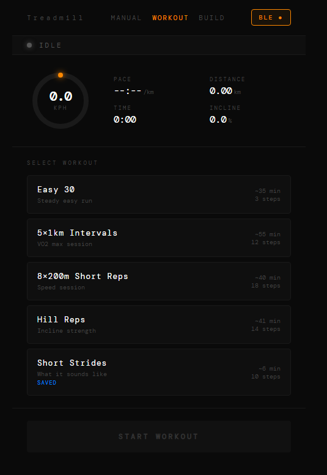

iFit Treadmill Local Controller (No Subscription, BLE, Raspberry Pi)

  

A lightweight Python web server that gives you full wireless control of a ProForm Carbon TL (and likely other iFit-compatible treadmills) from any browser on your network — no app, no subscription, no cloud.

What It Does
Manual control — start, stop, pause, resume, set speed and incline via a web UI
Guided workouts — interval sessions with automatic speed/incline changes
Workout builder — create and save custom sessions
Live stats — speed, pace, distance, time, incline, and pulse (if available)
Persistent BLE connection — survives page navigation and multiple tabs
Runs on boot — systemd service support
Hardware
Treadmill: ProForm Carbon TL (PFTL59722c) — likely compatible with other iFit BLE treadmills
Raspberry Pi 4 (1GB+ recommended)
BLE + WiFi connectivity
How It Works

The treadmill communicates over Bluetooth LE using the iFit protocol.
This project uses a Python BLE client with a FastAPI WebSocket server.

Browser sends commands via WebSocket
Server translates to BLE
Status is streamed back in real time
Requirements
Raspberry Pi OS (Bookworm recommended)
Python 3.11+ (3.12+ supported via patched ifit library below)
Bluetooth enabled
Treadmill BLE activation code
Quick Start

git clone https://github.com/BitmanKiwi/Ifit-Treadmill-Pi.git

cd Ifit-Treadmill-Pi

python3 -m venv venv
source venv/bin/activate

pip install fastapi uvicorn websockets bleak

git clone https://github.com/BitmanKiwi/ifit.git
 ~/ifit
cd ~/ifit
pip install -e .

cd -

python server.py

Open: http://<your-pi-ip>

Configuration

Edit server.py:

MAC = 'XX:XX:XX:XX:XX:XX'
CODE = 'your_activation_code_here'

Project Structure

server.py
workouts.json
static/
treadmill_manual.html
treadmill_workout.html
treadmill_build.html

Optional: Run as a Service

sudo cp treadmill.service /etc/systemd/system/
sudo systemctl daemon-reload
sudo systemctl enable treadmill
sudo systemctl start treadmill

Usage
/ → Manual control
/workout → Run sessions
/build → Create workouts

Press CONNECT to start BLE connection.

Limits
Speed: 2.0 – 18.0 kph
Incline: 0 – 10%
Finding Your Activation Code

Activation discovery documentation is included in the patched ifit fork:

https://github.com/BitmanKiwi/ifit/blob/main/docs/ACTIVATION_DISCOVERY.md

Troubleshooting

BLE issues:

sudo rfkill unblock bluetooth
sudo systemctl restart bluetooth
sudo systemctl restart treadmill

Logs:

journalctl -u treadmill -n 50

Compatibility

Tested on ProForm Carbon TL (PFTL59722c)

Credits

Original BLE protocol research and implementation:
https://github.com/ianchi/ifit

Patched and extended Python library (Python 3.12+ support and activation tooling):
https://github.com/BitmanKiwi/ifit

License

MIT
